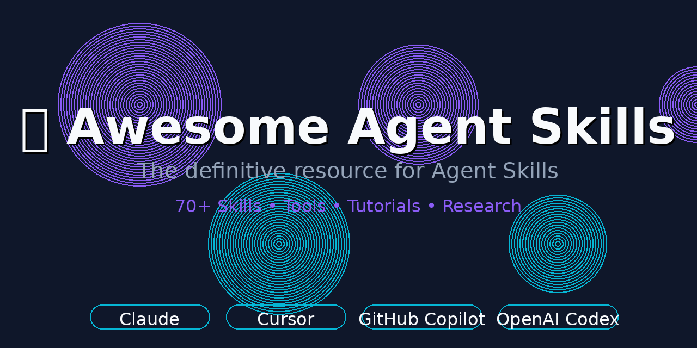

# 🎯 Awesome Agent Skills 

  

 

## 💡 What Are Agent Skills?

**Agent Skills** mark a fundamental shift from monolithic AI systems to composable agent architectures. Rather than embedding capabilities through expensive fine-tuning or bloating context windows with static documentation, skills provide **modular, on-demand knowledge injection** through standardized `SKILL.md` packages.

### The Architecture

**Progressive Disclosure at Scale**: Skills leverage a three-tier context management strategy:
1. **Discovery** (~50 tokens): Lightweight metadata (name + description) loads at startup
2. **Activation** (~2-5K tokens): Full `SKILL.md` instructions load when task-relevant  
3. **Execution**: Referenced scripts and resources accessed dynamically

This architecture delivers:
- 🧠 **Infinite capability scaling** - No context window trade-offs
- ⚡ **Sub-second skill loading** - Zero startup latency penalty
- 🔄 **Cross-platform portability** - Write once, deploy to any compatible agent
- 📦 **Frictionless distribution** - Share via Git, install like packages

### The Revolution

**From specialized agents to universal platforms**: Instead of building separate coding agents, research agents, and analysis agents, the industry is converging on **general-purpose agents with skill libraries**. One agent. Unlimited specializations. Dynamic composition.

> "We used to think agents in different domains will look very different. The agent underneath is actually more universal than we thought."  
> — *Barry Zhang, Anthropic Research*

**The open standard advantage**: Major platforms (OpenAI, GitHub, Microsoft, Cursor) have adopted the Agent Skills specification, creating **network effects**: every skill you create works across the entire ecosystem. This is the npm moment for AI agents.

### 🏷️ Key Topics

`agent-skills` · `ai-agents` · `llm` · `claude` · `anthropic` · `skill-md` · `progressive-disclosure` · `context-management` · `ai-development` · `mcp` · `agent-architecture` · `agentic-ai` · `automation` · `productivity`

👉 **New to Agent Skills?** Start here: [agentskills.io](https://agentskills.io)

## 📚 What's Inside?

- [🎁 Ready-to-Use Skills](#-ready-to-use-skills) - Start building with production-ready skill libraries
- [🛠️ Tools & Platforms](#️-tools--platforms) - Leverage platforms with native Agent Skills support
- [📖 Learn & Explore](#-learn--explore) - Master the concepts through deep-dive articles
- [🎬 Videos & Tutorials](#-videos--tutorials) - Watch experts build real-world agent systems
- [🔬 Research Papers](#-research-papers) - Understand the science behind agent capabilities
- [❓ Frequently Asked Questions](#-frequently-asked-questions) - Get answers to common questions
- [💬 Join the Community](#-join-the-community) - Connect with pioneers shaping the ecosystem
- [🤝 Contributing](#-contributing) - Help shape the future of agent development

## 🎁 Ready-to-Use Skills

**Don't build from scratch - stand on the shoulders of giants.** Tap into battle-tested skill libraries and specialized capabilities that power production agent systems today.

### 📚 Skills Collections & Repositories

**Multi-skill repositories** with diverse capabilities:

- [🏢 Official collection from Anthropic (document editing, data analysis, etc.)](https://github.com/anthropics/skills){:target="_blank"}
- [⭐ 50+ verified skills for Claude Code and Claude.ai](https://github.com/karanb192/awesome-claude-skills){:target="_blank"}
- [🗂️ Curated Claude Agent Skills collection](https://github.com/hikanner/agent-skills){:target="_blank"}
- [🎨 Voice AI, image generation, and web development](https://github.com/lifegenieai/claude-skills){:target="_blank"}
- [🤝 Multi-agent collaboration skills](https://github.com/GuDaStudio/skills){:target="_blank"}
- [🐍 Pydantic AI integration](https://github.com/DougTrajano/pydantic-ai-skills){:target="_blank"}
- [🔮 Skills for DSPy framework](https://github.com/OmidZamani/dspy-skills){:target="_blank"}
- [🎬 Freeact agent library skills](https://github.com/gradion-ai/freeact-skills){:target="_blank"}
- [📊 Document editing, data analysis, and project management](https://github.com/ponderous-dustiness314/awesome-claude-skills){:target="_blank"}
- [✨ Productivity-focused skills](https://github.com/jacintarefined358/awesome-claude-skills){:target="_blank"}
- [🎯 Skills for specialized capabilities](https://github.com/shajith003/awesome-claude-skills){:target="_blank"}

### 🎯 Individual Skills by Category

#### 💻 Development & Programming

- [Stream Coding methodology (10-20x velocity)](https://github.com/frmoretto/stream-coding){:target="_blank"}
- [Multi-language code execution](https://github.com/formulahendry/agent-skill-code-runner){:target="_blank"}
- [Swift Programming Language reference](https://github.com/kylehughes/the-unofficial-swift-programming-language-skill){:target="_blank"}
- [Swift Concurrency Migration guide](https://github.com/kylehughes/the-unofficial-swift-concurrency-migration-skill){:target="_blank"}
- [Obsidian.md plugin development](https://github.com/gapmiss/obsidian-plugin-skill){:target="_blank"}

#### 🔒 Security & Operations

- [Offensive/defensive security operations with sub-agents](https://github.com/gadievron/raptor){:target="_blank"}

#### 🔧 Integration & Automation

- [Web browser capability for agents](https://github.com/SawyerHood/dev-browser){:target="_blank"}
- [Skills for any agent via CLI or MCP](https://github.com/gotalab/skillport){:target="_blank"}
- [Load skills using Model Context Protocol](https://github.com/DiscreteTom/agent-skills-mcp){:target="_blank"}
- [Google Sheets CLI automation](https://github.com/gmickel/sheets-cli){:target="_blank"}
- [Spotify API integration](https://github.com/fabioc-aloha/spotify-skill){:target="_blank"}
- [MIDI file generation from text](https://github.com/tubone24/midi-agent-skill){:target="_blank"}

#### 🧠 AI & Context Engineering

- [Context engineering techniques](https://github.com/muratcankoylan/Agent-Skills-for-Context-Engineering){:target="_blank"}
- [Mind cloning with LLM skills](https://github.com/yzfly/Mind-Cloning-Engineering){:target="_blank"}
- [System Skill Pattern (skills that remember & improve)](https://github.com/jakedahn/pomodoro){:target="_blank"}
- [Auto-convert Skills for AGENTS.md](https://github.com/dave1010/skills-to-agents){:target="_blank"}

## 🛠️ Tools & Platforms

**The ecosystem is here.** Industry-leading platforms have already integrated Agent Skills - your next agent build starts with choosing the right foundation.

### 🎨 IDEs & Code Editors

- [OpenCode](https://opencode.ai/) - 🎯 AI development tool with built-in Agent Skills support
- [Cursor](https://cursor.com/) - ⚡ AI-powered code editor with native skills integration ([docs](https://cursor.com/docs/context/skills))
- [Amp](https://ampcode.com/) - 🚀 Next-gen AI coding assistant
- [Claude Code](https://claude.ai/code) - 🤖 Anthropic's coding tool with first-class skills support
- [OpenAI Codex](https://developers.openai.com/codex/skills/) - 💻 OpenAI's CLI agent with Agent Skills support

### 🤖 AI Agent Platforms

- [Letta](https://www.letta.com/) - 🧠 Build stateful LLM agents with memory
- [Goose](https://block.github.io/goose/) - 🦆 Open source AI agent framework
- [GitHub Copilot](https://github.com/features/copilot) - 💙 GitHub's AI coding assistant with Agent Skills support ([docs](https://docs.github.com/copilot/concepts/agents/about-agent-skills), [announcement](https://github.blog/changelog/2025-12-18-github-copilot-now-supports-agent-skills/))
- [VS Code](https://code.visualstudio.com/) - 💻 Microsoft's editor with Agent Skills in Insiders build

### 🔧 Developer Tools & Libraries

- [openskills](https://github.com/numman-ali/openskills) - 📦 Universal skills loader for any AI agent
- [vibe-tools](https://github.com/eastlondoner/vibe-tools) - 👥 Give your agent an AI team with advanced skills
- [IntentKit](https://github.com/crestalnetwork/intentkit) - 🎭 Framework for intent-driven AI agents
- [Agentica](https://github.com/wrtnlabs/agentica) - 📘 TypeScript AI function calling framework
- [agentigy/skillcheck](https://github.com/agentigy/skillcheck) - 🔒 Security scanner for SKILL.md files - detect vulnerabilities before production
- [AIPexStudio/AIPex](https://github.com/AIPexStudio/AIPex) - 🌐 Privacy-first AI browser automation with Agent Skills
- [breaking-brake/cc-wf-studio](https://github.com/breaking-brake/cc-wf-studio) - 🎬 ClaudeCode Workflow Studio VSCode extension with slash commands
- [LangChain Deep Agents](https://github.com/langchain-ai/deepagents) - 🔗 Open source agent harness with skills support ([blog](https://blog.langchain.com/using-skills-with-deep-agents/))

## 📖 Learn & Explore

**From zero to expert in hours, not weeks.** Curated resources that take you from understanding the fundamentals to architecting production-grade agent systems.

### 🎓 Getting Started

- [What are skills?](https://support.claude.com/en/articles/12512176-what-are-skills) - 📝 Perfect introduction for beginners
- [Using skills in Claude](https://support.claude.com/en/articles/12512180-using-skills-in-claude) - 🚀 Quick start guide

### 🏗️ Building Skills

- [How to create custom skills](https://support.claude.com/en/articles/12512198-creating-custom-skills) - ✍️ Step-by-step authoring guide
- [Skills API Quickstart](https://docs.claude.com/en/api/skills-guide#creating-a-skill) - 💻 Technical documentation- [A2A Protocol: Agent Skills Tutorial](https://a2a-protocol.org/latest/tutorials/python/3-agent-skills-and-card/) - 🤝 How skills work in the Agent-to-Agent protocol
### 📰 Featured Articles

- [Equipping agents for the real world with Agent Skills](https://anthropic.com/engineering/equipping-agents-for-the-real-world-with-agent-skills) - 🎯 The original announcement from Anthropic Engineering
- [How I Built Agent Skills for Claude Code](https://dev.to/nunc/how-i-built-agent-skills-for-claude-code-oj4) - 🛠️ 8-minute tutorial on building custom Agent Skills from scratch
- [Claude Skills vs MCP: Complete Guide](https://dev.to/jimquote/claude-skills-vs-mcp-complete-guide-to-token-efficient-ai-agent-architecture-4mkf) - ⚖️ Comparison of Skills and Model Context Protocol architectures
- [GitHub Copilot Agent Skills: Teaching AI Your Repository Patterns](https://dev.to/qa-leaders/github-copilot-agent-skills-teaching-ai-your-repository-patterns-1oa8) - 🔍 Using Agent Skills with GitHub Copilot
- [From 2 Hours to 5 Minutes: Automating CDC Transformations](https://medium.com/@jagadeesh.subramani) - 📊 Real-world case study: 95% efficiency gain with Agent Skills
- [Advent of AI 2025 - Day 14: Agent Skills](https://dev.to/nickytonline/advent-of-ai-2025-day-14-agent-skills-4d48) - 🎄 5-minute guide to Agent Skills with Goose
- [Agent Skill in VS Code](https://dev.to/thangchung/agent-skill-in-vs-code-77d) - 💻 Using Agent Skills directly in VS Code
- [Code Sandbox Tech Behind Manus and Claude Agent Skills](https://dev.to/qtalen/exclusive-reveal-code-sandbox-tech-behind-manus-and-claude-agent-skills-ef2) - 🏗️ Deep dive into sandboxing technology
- [OpenSkills: Adding Claude Skills for Any Agent or IDE](https://dev.to/wakeupmh/openskills-adding-claude-skills-and-superpowers-for-any-agent-or-ide-3j35) - 🚀 Universal skills integration guide
- [Agent Skills Framework Analysis: Litho Implementation](https://dev.to/sopaco/agent-skills-framework-analysis-litho-implementation-and-design-philosophy-2l91) - 🏛️ Architecture and design patterns analysis
- [The Great AI Agent Configuration Confusion](https://medium.com/@satinath.mondal/the-great-ai-agent-configuration-confusion-agents-md-skill-md-and-whats-next-12345) - 📋 Understanding configuration standards (SKILL.md, AGENTS.md)

### 📰 Industry News & Analysis

- [Anthropic launches enterprise Agent Skills and opens the standard](https://venturebeat.com/ai/anthropic-launches-enterprise-agent-skills-and-opens-the-standard) - 🎯 VentureBeat deep dive: Why Anthropic is giving away its competitive advantage
- [Agent Skills: Anthropic's Next Bid to Define AI Standards](https://thenewstack.io/agent-skills-anthropics-next-bid-to-define-ai-standards/) - 🖋️ The New Stack analysis of the open standard strategy

## 🎬 Videos & Tutorials

**See it in action.** Watch developers build real agent systems from scratch - from 1-minute quickstarts to hour-long engineering deep dives.

### 🎓 Beginner-Friendly Tutorials

- [A better way to build agents? Claude Agent Skills Tutorial + Demo](https://www.youtube.com/watch?v=mxZqEduwyFk) - 🎥 11-minute intro: Is Agent Skills the next big standard after MCP?
- [Claude Code Skills just Built me an AI Agent Team (2026 Guide)](https://www.youtube.com/watch?v=OdtGN27LchE) - 🚀 27-minute beginner guide to building general AI agents
- [Claude's new 'Agent Skills'](https://www.youtube.com/watch?v=VRzkafNIdgI) - ⚡ 1-minute quick overview - installable "mini-brains"
- [Agent Skills Review](https://www.youtube.com/watch?v=tGpeWM7gOlA) - 📋 25-second feature highlight

### 🔧 Technical Deep Dives

- [I finally CRACKED Claude Agent Skills (Breakdown For Engineers)](https://www.youtube.com/watch?v=kFpLzCVLA20) - 🛠️ 27-minute engineering breakdown: Skills vs MCP vs Subagents
- [Claude Agent Skills](https://www.youtube.com/watch?v=9XaprFRNTlc) - 🎯 1-hour deep dive into domain-specific AI expertise
- [Agent Skills Explained: Why This Changes Everything](https://www.youtube.com/watch?v=Ihoxov5x66k) - 💡 17-minute analysis of why Skills matter for AI development
- [Claude Agent Skills Tutorial](https://www.youtube.com/watch?v=fOxC44g8vig) - 🎥 Comprehensive implementation tutorial with SKILL.md format

### 🆚 Comparisons & Analysis

- [Agent Skills vs MCP Which Is Better?](https://www.youtube.com/watch?v=Pc2sB8v9570) - ⚖️ 5-minute comparison: MCP vs Skills architecture
- [Claude Skills vs MCP: Complete Guide](https://dev.to/jimquote/claude-skills-vs-mcp-complete-guide-to-token-efficient-ai-agent-architecture-4mkf) - 📊 Written guide for token-efficient architectures

### 🏢 Real-World Applications

- [Claude Skills Built Me an AI Agent Army](https://www.youtube.com/watch?v=G-5bInklwRQ) - 🤖 33-minute practical demo: Building digital employees
- [OpenAI Adds Agent Skills to Codex](https://www.youtube.com/watch?v=MsJzacfjzp8) - 🔥 6-minute first look at Codex with Skills support
- [Agent Skills AI Real Work](https://www.youtube.com/watch?v=Udneqo7up2M) - 💼 3-minute overview of customizable Claude agents

### 🎤 Conference Talks

- [Don't Build Agents, Build Skills Instead](https://www.youtube.com/watch?v=CEvIs9y1uog) - 🎙️ 16-minute talk by Barry Zhang & Mahesh Murag (Anthropic)

> 💡 **Know a great video?** We're actively looking for more video content! Please [contribute](CONTRIBUTING.md) if you find or create relevant tutorials.

## 🔬 Research Papers

**Understand the foundations.** Cutting-edge research exploring the architecture, security implications, and theoretical underpinnings of skills-based agent systems.

### 🛡️ Security & Safety

- 📄 [Agent Skills Enable a New Class of Realistic and Trivially Simple Prompt Injections](https://arxiv.org/abs/2510.26328) (2025) - Security analysis showing vulnerabilities in Agent Skills markdown files

### 🌐 Interoperability & Standards

- 📄 [A survey of agent interoperability protocols](https://arxiv.org/abs/2505.02279) (2025) - Comprehensive look at MCP, Agent Cards, and more

### 📊 Progressive Disclosure & Transparency

- 📄 [The Effect of Progressive Disclosure in the Transparency of Large Language Models](https://link.springer.com/chapter/10.1007/978-3-031-82633-7_17) (2024) - How progressive disclosure affects LLM transparency
- 📄 [Disclosures & disclaimers: Investigating the impact of transparency disclosures](https://ojs.aaai.org/index.php/HCOMP/article/view/31597) (2024) - Impact study on agent transparency

### 🧠 Skill Learning & Architecture

- 📄 [Reinforcement Learning for Self-Improving Agent with Skill Library](https://arxiv.org/abs/2512.17102) (2024) - Framework for agents to build and maintain skill libraries
- 📄 [PolySkill: Learning Generalizable Skills Through Polymorphic Abstraction](https://arxiv.org/abs/2510.15863) (2024) - Learning generalizable skills through polymorphic abstraction

> 💡 **Note:** Agent Skills (SKILL.md format) is a recent innovation (2024-2025), so academic research is still emerging. Most papers focus on related concepts like skill learning, tool use, and agent architectures.

## ❓ Frequently Asked Questions

### What are Agent Skills?

Agent Skills are modular, standardized `SKILL.md` packages that provide AI agents with on-demand capabilities. Instead of fine-tuning models or bloating context windows, skills enable **progressive disclosure**: lightweight metadata loads at startup (~50 tokens), full instructions activate when needed (~2-5K tokens), and resources load dynamically during execution.

### How do Agent Skills differ from fine-tuning?

Fine-tuning modifies model weights permanently (expensive, inflexible), while Agent Skills provide **runtime knowledge injection** that's instantly updatable, shareable across platforms, and requires zero retraining. Update a skill once, and every agent using it benefits immediately.

### What's the difference between Agent Skills and MCP (Model Context Protocol)?

**Agent Skills** focus on **capabilities and workflows** (how to do X), while **MCP** focuses on **data access** (connecting to APIs, databases). They're complementary: use MCP to connect to external data sources, use Skills to teach agents how to process that data. Many developers use both together.

### How do I create my first Agent Skill?

1. Create a `SKILL.md` file with YAML frontmatter (name, description)
2. Write clear instructions in markdown (what, when, how)
3. Add optional `scripts/` folder for code references
4. Place in `.github/skills/` or `.claude/skills/` directory
5. Test with compatible platforms (Claude Code, Cursor, GitHub Copilot)

👉 Full guide: [How to create custom skills](https://support.claude.com/en/articles/12512198-creating-custom-skills)

### Which AI platforms support Agent Skills?

Major platforms with native support include: **Claude** (Claude.ai, Claude Code), **OpenAI** (Codex CLI), **GitHub Copilot**, **Cursor**, **VS Code Insiders**, **OpenCode**, **Amp**, **Letta**, and **Goose**. The ecosystem is rapidly expanding as more platforms adopt the open standard.

### Can I use Agent Skills with ChatGPT or other LLMs?

While ChatGPT doesn't natively support the Agent Skills format, you can use universal loaders like [openskills](https://github.com/numman-ali/openskills) to integrate skills with any LLM platform. The skills specification is open and platform-agnostic by design.

### Are Agent Skills secure?

Agent Skills introduce new security considerations. Since skills can execute code and access files, always **review skills before installation** from untrusted sources. Use tools like [skillcheck](https://github.com/agentigy/skillcheck) to scan for vulnerabilities. Research shows potential for prompt injection attacks ([arxiv.org/abs/2510.26328](https://arxiv.org/abs/2510.26328)), so treat skills like code packages—audit before trusting.

### How do I share Agent Skills with my team?

**Option 1**: Commit to your repository's `.github/skills/` or `.claude/skills/` directory—agents automatically discover them.  
**Option 2**: Publish to GitHub as a standalone repo (e.g., `my-org/data-analysis-skill`)—others can reference or clone.  
**Option 3**: Use [skillport](https://github.com/gotalab/skillport) or [agent-skills-mcp](https://github.com/DiscreteTom/agent-skills-mcp) for cross-platform distribution.

### What makes a good Agent Skill?

**Best practices:**
- ✅ **Single responsibility** - One clear capability per skill
- ✅ **Progressive detail** - Brief metadata, detailed instructions, extensive resources
- ✅ **Context-aware** - Include when/why to use (not just how)
- ✅ **Testable** - Provide example inputs/outputs
- ✅ **Discoverable** - Descriptive names and rich descriptions

### When should I use Agent Skills vs custom tools/functions?

Use **Agent Skills** when:
- Capabilities need to work across multiple platforms
- Instructions are complex multi-step workflows
- You want version control and collaborative editing
- Knowledge needs frequent updates

Use **custom tools/functions** when:
- Platform-specific integration required (e.g., API-specific features)
- Real-time data access needed
- Computational logic can't be expressed as instructions

### Can Agent Skills call other Agent Skills?

Yes! Skills can reference other skills in their instructions, enabling **skill composition**. This allows building complex capabilities from simple, reusable building blocks. Some platforms also support **skill libraries** where skills automatically discover and leverage related capabilities.

### How do Agent Skills impact token usage?

**Dramatically reduce it.** Traditional approaches load all documentation upfront (10K-100K tokens), while skills load only what's needed (50 tokens metadata + 2-5K when activated). For agents managing 50+ capabilities, this means **90%+ token reduction** during idle time.

### Are Agent Skills just for coding tasks?

No—Agent Skills work for any domain: **data analysis**, **content creation**, **project management**, **research**, **security operations**, **automation**, and more. The format is domain-agnostic. Think of them as "packages for knowledge" rather than "packages for code."

### Where can I find production-ready Agent Skills?

Start with:
- [anthropics/skills](https://github.com/anthropics/skills) - Official Anthropic collection
- [karanb192/awesome-claude-skills](https://github.com/karanb192/awesome-claude-skills) - 50+ verified skills
- This repository's [Ready-to-Use Skills](#-ready-to-use-skills) section

### How often should I update my Agent Skills?

Update skills whenever:
- Platform APIs or tools change
- Better approaches emerge
- Team workflows evolve
- User feedback reveals gaps

**Pro tip**: Add version numbers and changelogs to your skills for better tracking.

## 💬 Join the Community

**You're not alone in this.** Join thousands of developers pioneering the future of AI agents - share breakthroughs, debug challenges, and shape the standards.

- 💭 [Agent Skills GitHub Discussions](https://github.com/agentskills/agentskills/discussions) - Official specification discussions
- 🐛 [Anthropic Skills GitHub Issues](https://github.com/anthropics/skills/issues) - Report issues and request features
- ⭐ **Star this repo** to stay updated with the latest resources!

## 🤝 Contributing

**Shape the ecosystem.** This is a community-driven resource - your contributions help thousands of developers discover and build better agent systems.

- 🔗 Add new skills, tools, or articles
- 📝 Improve documentation
- 🐛 Fix broken links
- 💡 Suggest new sections

Please read our [contribution guidelines](CONTRIBUTING.md) before submitting.

---

**Found this useful? Give it a ⭐ and share it with others!**

*Built with ❤️ by the Agent Skills community*

